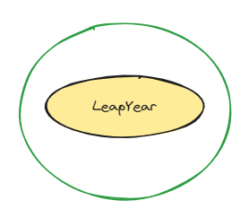

#### 1. Descripción de la Kata

Implementar una función para determinar si un año es bisiesto o no con estas características:

- Los años divisibles por 400 son bisiestos
- Los años divisibles por 100 pero no por 400, **NO** son bisiestos
- Los años divisibles por 4 pero no por 100 son bisiestos
- Los años no divisibles por 4 **NO** son bisiestos


#### 2. Definir lista de tests de ejemplos (Specification-based testing)

1) Establecemos la lista de comportamientos en base a los requisitos.
2) Basándonos en los comportamientos e Input/Ouputs disgregamos esos comportamientos en "Particiones" y combinaciones de ellas.
3) Tenemos en cuenta las invariantes.
4) Hacemos la lista de tests en base a todo lo anterior.

```c#

// ---> INPUTS
input: string(year) ----> output: bool (true or false si es bisiesto)

// ---> BEHAVIOURS
1. Año divisible por 400 => (es bisiesto) => TRUE
2. Año divisible por 100, no divisible por 400  => (NO es bisiesto) => FALSE
3. Año divisible por 4, no divisible por 100 => (es bisiesto) => TRUE
4. Año no divisible por 4, => (NO es bisiesto) => FALSE


// ---> BEHAVIOURS
P1: inputs: year(string) => output: bisiesto(FALSE)
	- No divisible por 4
		. 1995, 2001, 2025

P2: inputs: year(string) 
	- Divisible por 4, no divisible por 100  => output: bisiesto(TRUE)  
		. 1996, 2024, 2028
	- Divisible por 4, si divisible por 100  => output: bisiesto(FALSE)
		. 1900, 2100, 2200

P3: inputs: year(string) 
	- Divisible por 400 => output: bisiesto(TRUE) 
		. 2000, 2400, 2800
	- No divisible por 400
		- si divisible por 100 => output: bisiesto(FALSE)  
			. 1900, 2100, 2200
	
//lista de tests
casos de las parciciones. 
```


#### 3. Definir las dependencias incómodas y los colaboradores 



No hay colaboradores.